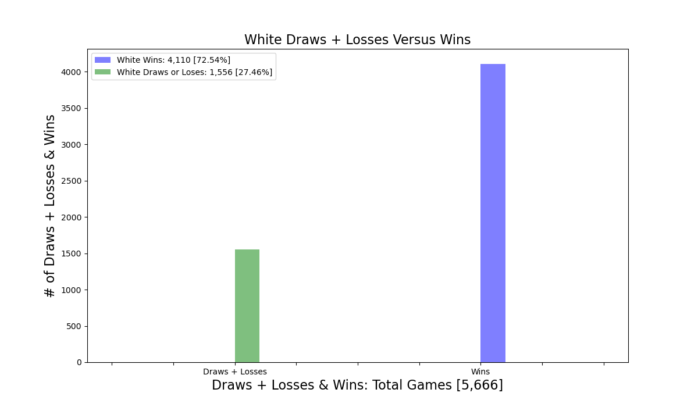
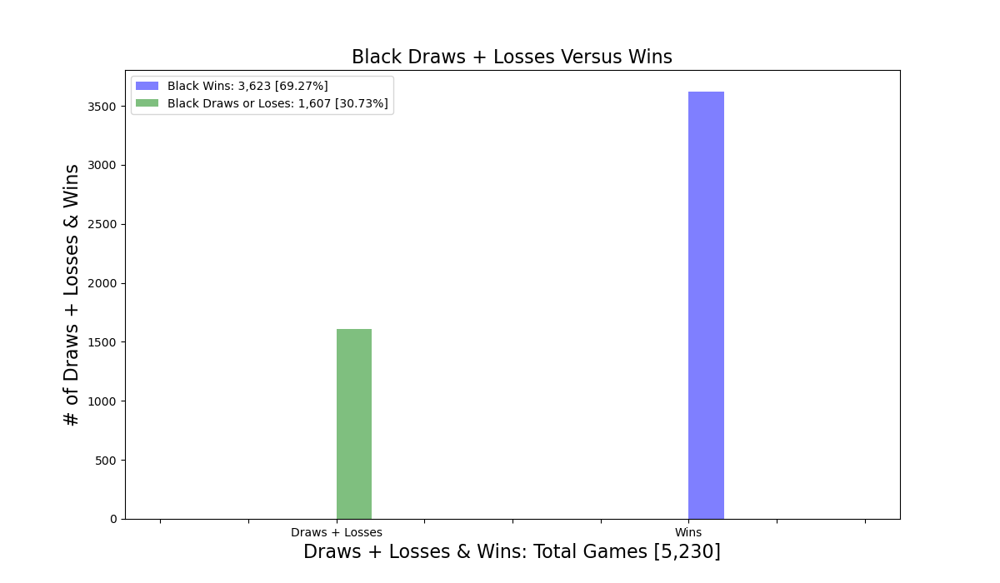
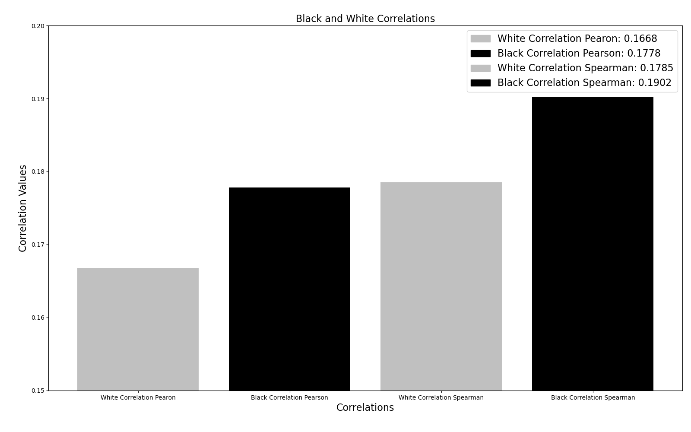

# chess_games
 

# Chess

***
 

# Table of Contents
- 
 

***
## **Introduction**
***
This dataset, which can be found [here](https://www.kaggle.com/datasets/datasnaek/chess), is a set of just over 20,000 chess games collected from a selection of users on the site Lichess.org.

Lots of information is contained within a single chess game, let alone a full dataset of multiple games. It is primarily a game of patterns, and data science is all about detecting patterns in data, which is why chess has been one of the most invested in areas of AI in the past.

 

***
## **Background Information**
***
The information conatined in the chess dataset is comprosed of the following factors:

- Game ID

- Rated (T/F)

- Start Time

- End Time

- Number of Turns

- Game Status

- Winner

- Time Increment

- White Player ID

- White Player Rating

- Black Player ID

- Black Player Rating

- All Moves in Standard Chess Notation

- Opening Eco (Standardised Code for any given opening, list here)

- Opening Name

- Opening Ply (Number of moves in the opening phase)

 
 

***
## **Overall**
***
The dataset provides a multitude of factors pertaining to chess games. After analyzing and cleaning the data [Chess Games](data/games.csv), it was determined that a logical focus would be on the outcomes of the [games](#chess-outcomes-breakdown) and more specifically the partitioning of [wins versus draws](#chess-outcomes-breakdown).
 

***
## Data Analysis & Vizualization
Listed below is the data analysis and vizualization aspects for the chess games dataset.
***

### Chess Outcomes Breakdown
***
After analyzing the outcomes of all of the chess games, it was revealed that a majority of the games ended in resignations and the least amount of games ended in draws.

  

The next step was to aggregate all forms of wins, which are resignations, out of time, and mates, and perform a direct comparison against the amount of draws.

  

***
### Hypothesis Testings
***
After seeing the disparity in overall wins versus losses, the next approach was to partition the dataset into two separate datasets for white and black based on the respective player being the superior opponent, or greater than 100 ELO difference, and mapped wins to 1 and draws or losses to 0. Then, for both datasets, we generated our null and alernative hypothesis, which are depcited below, and performed two-sample independent t-tests to analyze the p-values and ultimately the null & alternative hypotheses for rating differentials, number of consecutive moves where a player follows an optimal book, and number of turns in the game.   

Null Hypothesis 1: The rating differential between black and white has no significance on which player wins the game.  

Alternative Hypothesis 1: The rating differential between black and white has a significance on which player wins the game.  

Null Hypothesis 2: The number of consecutive moves where a player follows an optimal book opening has no significance on which player wins the game.  

Alternative Hypothesis 2: The number of consecutive moves where a player follows an optimal book opening has a significance on which player wins the game.  

Null Hypothesis 3: The number of turns in a game has no significance on which player wins the game.  

Alternative Hypothesis 3: The number of turns in a game has significance on which player wins the game.  

After seeing the disparity in overall wins versus losses, the next approach was to partition the dataset into two separate datasets for white and black respectively.  

***
A summary of the two-sample independent t-test results for black and white are found below. Additionally, histogram plots were generated to display player wins versus draws and losses when that respective player is the superior opponent..
***

White Games [Superior Opponent]:

As we can see, the p-value for rating differential, number of turns, and opening play is less than 0.05, with values of 0.00, so we reject all the null hypotheses and there is significant difference, or impact, between: the white rating differentials, the consecutive moves used from an optimal book opening, the number of turns in the game, all in relation to who wins the game. Additionally, the high t-statistic of approximately 116.77, 109.70, and 129.08 for rating differentials, opening book play, and number of turns simply indicates the confidence in the predictor coefficient, since it's very large, and further supports the decision to reject the null hypothesis.  

When only considering wins and draws plus losses of a higher-ranked white opponent, white wins 72.54% of the time and draws or loses 27.46% of the time over 5,666 games.  

***
Black Games [Superior Opponent]:

The p-value for rating differential, number of turns, and opening play is less than 0.05, with values of 0.00, so we reject all the null hypotheses and there is significant difference, or impact, between: the black rating differentials, the consecutive moves used from an optimal book opening, the number of turns in the game, all in relation to who wins the game. Additionally, the high t-statistic of approximately 114.47, 99.36, and 127.15 for rating differentials, opening book play, and number of turns simply indicates the confidence in the predictor coefficient, since it's very large, and further supports the decision to reject the null hypothesis.  

When only considering wins and draws plus losses of a higher-ranked black opponent, black wins 69.27% of the time and draws or loses 30.73% of the time over 5,230 games.  

***
### Correlations: Pearson & Spearman
***
Next, perform linear, Pearson correlations and nonlinear, Spearman correlation to see potential correlations between rating differentals, for white and black respectively, and their victory status. Shockingly, there is no true correlation between white or black being a significantly stronger opponent, in terms of ELO rating, and winning games versus losing or drawing games, as seen from the linear, Pearson correlations and the nonlinear, Spearman correlations below. Intuitively, one would think that over a continuous span of graudually increasing ELO differentials, there would be a correlation to the majority, binary class of 1, which is wins. 